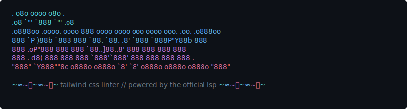

<p align="center">
  
</p>

<p align="center">
  <a href="https://www.npmjs.com/package/tailwint"></a>
  <a href="https://github.com/peterwangsc/tailwint/blob/main/LICENSE"></a>
  <a href="https://www.npmjs.com/package/tailwint"></a>
</p>

---

The same diagnostics VS Code shows — but from the command line. Catches class conflicts, suggests canonical rewrites, and auto-fixes everything. Built on the official `@tailwindcss/language-server`.

**Works with Tailwind CSS v4.**

## What it catches

tailwint detects two categories of issues:

**⚡ Conflicts** — classes that apply the same CSS properties, where the last one wins and the rest are dead code:

```
⚡ 3:21  conflict  'w-full' applies the same CSS properties as 'w-auto'
⚡ 3:28  conflict  'w-auto' applies the same CSS properties as 'w-full'
```

**○ Canonical** — classes that can be written in a shorter or more idiomatic form:

```
○ 3:21 canonical The class `flex-shrink-0` can be written as `shrink-0`
○ 3:35 canonical The class `z-[1]` can be written as `z-1`
○ 3:41 canonical The class `min-w-[200px]` can be written as `min-w-50`
```

## Install

```bash
npm install -D tailwint @tailwindcss/language-server
```

## Usage

```bash
# Scan default file types (tsx, jsx, html, vue, svelte, astro, mdx, css)
npx tailwint

# Scan specific files
npx tailwint "src/**/*.tsx"

# Auto-fix all issues
npx tailwint --fix
npx tailwint -f

# Fix specific files
npx tailwint --fix "app/**/*.tsx"

# Verbose LSP logging
DEBUG=1 npx tailwint
```

## Example output

```
  ~≈∼〜~≈∼〜~≈∼〜~≈∼〜~≈~ tailwint ~∼〜~≈∼〜~≈∼〜~≈∼〜~≈∼~

    tailwind css linter // powered by the official lsp

  ✔ language server ready ~≈∼〜~≈∼〜~≈∼〜~≈∼〜~≈∼〜~≈∼〜~
  ✔ sent 42 files to lsp ~≈∼〜~≈∼〜~≈∼〜~≈∼〜~≈∼〜~≈∼〜~~
  ✔ 42/42 files received ~≈∼〜~≈∼〜~≈∼〜~≈∼〜~≈∼〜~≈∼〜~~

  42 files scanned // 8 conflicts │ 12 canonical

  ┌ components/Card.tsx (3)
    ⚡ 5:21  conflict  'w-full' applies the same CSS properties as 'w-auto'
    ○ 5:35 canonical The class `flex-shrink-0` can be written as `shrink-0`
    ○ 5:49 canonical The class `z-[1]` can be written as `z-1`
  └~≈∼

  ≈∼〜~≈  ✘ FAIL  20 issues in 3 files 2.1s ≈∼〜~≈
  run with --fix to auto-fix
```

With `--fix`:

```
  ⚙ FIX  conflicts first, then canonical

  ✔ ┃━━━━━━━━━━━━━━━━━━┃ Card.tsx 3 fixed
  ✔ ┃━━━━━━━━━━━━━━━━━━┃ Header.tsx 12 fixed
  ✔ ┃━━━━━━━━━━━━━━━━━━┃ Sidebar.tsx 5 fixed

  ≈∼〜~≈  ✔ FIXED  20 of 20 issues across 3 files 3.4s ≈∼〜~≈
```

## Supported file types

| Extension | Language ID     | Notes                                     |
| --------- | --------------- | ----------------------------------------- |
| `.tsx`    | typescriptreact | React / Next.js components                |
| `.jsx`    | javascriptreact | React components                          |
| `.html`   | html            | Static HTML files                         |
| `.vue`    | html            | Vue single-file components                |
| `.svelte` | html            | Svelte components                         |
| `.astro`  | html            | Astro components                          |
| `.mdx`    | mdx             | MDX documents                             |
| `.css`    | css             | `@apply` directives and Tailwind at-rules |

## Tailwind v4 support

tailwint fully supports Tailwind CSS v4 features:

- **Opacity shorthand** — `bg-red-500/50`, `text-blue-500/75`
- **`size-*` utility** — `size-10`, `size-full`
- **Container queries** — `@container`, `@lg:flex`, `@md:grid`
- **`has-*` / `not-*` variants** — `has-checked:bg-blue-500`, `not-disabled:opacity-100`
- **`aria-*` variants** — `aria-expanded:bg-blue-500`, `aria-disabled:opacity-50`
- **`data-*` variants** — `data-[state=open]:bg-blue-500`
- **`supports-*` variants** — `supports-[display:grid]:grid`
- **`forced-colors` variant** — `forced-colors:bg-[ButtonFace]`
- **Logical properties** — `ms-4`, `me-4`, `ps-4`, `pe-4`
- **Text wrap utilities** — `text-balance`, `text-pretty`, `text-nowrap`
- **Named groups/peers** — `group/sidebar`, `group-hover/sidebar:bg-blue-500`
- **CSS-first config** — `@import "tailwindcss"` with `@theme` directive

## Programmatic API

```ts
import { run } from "tailwint";

const exitCode = await run({
  patterns: ["src/**/*.tsx"],
  fix: true,
  cwd: "/path/to/project",
});
```

### Options

| Option     | Type       | Default                                            | Description                                        |
| ---------- | ---------- | -------------------------------------------------- | -------------------------------------------------- |
| `patterns` | `string[]` | `["**/*.{tsx,jsx,html,vue,svelte,astro,mdx,css}"]` | Glob patterns for files to scan                    |
| `fix`      | `boolean`  | `false`                                            | Auto-fix issues using LSP code actions             |
| `cwd`      | `string`   | `process.cwd()`                                    | Working directory for glob resolution and LSP root |

### Exports

| Export                       | Description                        |
| ---------------------------- | ---------------------------------- |
| `run(options?)`              | Run the linter, returns exit code  |
| `applyEdits(content, edits)` | Apply LSP text edits to a string   |
| `TextEdit`                   | TypeScript type for LSP text edits |

## CI integration

tailwint exits with meaningful codes for CI pipelines:

| Exit code | Meaning                                                          |
| --------- | ---------------------------------------------------------------- |
| `0`       | No issues found, or all issues fixed with `--fix`                |
| `1`       | Issues found, or unfixable issues remain after `--fix`           |
| `2`       | Fatal error (language server not found, crash)                   |

### GitHub Actions

```yaml
- name: Lint Tailwind classes
  run: npx tailwint
```

### Pre-commit hook

```bash
npx tailwint --fix && git add -u
```

## How it works

1. **Boot** — spawns `@tailwindcss/language-server` over stdio
2. **Pre-scan** — classifies CSS files to predict how many Tailwind projects the server will create, skips unrelated CSS files
3. **Open** — sends matched files to the server via `textDocument/didOpen`
4. **Analyze** — waits for `textDocument/publishDiagnostics` notifications (event-driven, project-aware — tracks each project's initialization and diagnostics separately)
5. **Report** — collects diagnostics, categorizes as conflicts or canonical
6. **Fix** _(if `--fix`)_ — requests `textDocument/codeAction` quickfixes and applies edits in a loop until no diagnostics remain

The fix loop is unbounded — it keeps applying edits until the file stabilizes. A single pass may not resolve everything (e.g., fixing a conflict can reveal a canonical issue underneath), so the loop continues as long as edits produce changes.

## Requirements

- Node.js 18+
- `@tailwindcss/language-server` >= 0.14.0 (peer dependency)

## License

MIT
